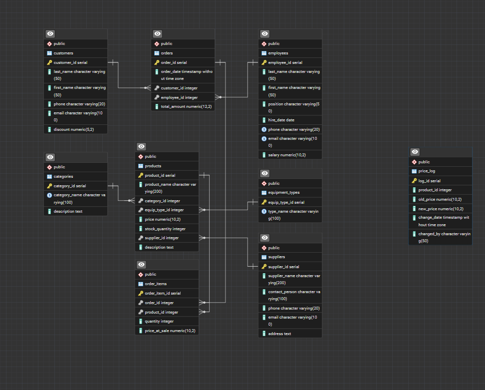

# УП сервис на Tkinter магазин запчастей тяжелой техники

---

## Стек по проекту

[](https://www.python.org/downloads/release/python-3100/)
[](https://pypi.org/project/SQLAlchemy/2.0.45/)
[](https://www.postgresql.org/)

---

## Запуск проекта

+ Установите зависимости к проекту `requirements.txt`

```shell
  pip install -r requirements.txt 
```

+ Установите `PostgreSQL 9.3+` версии и запустите файл `main.py`

```shell
  python main.py 
```

---

## БД

</img>

---

[✨ Developer 2024 🎉](https://github.com/Zagidin)